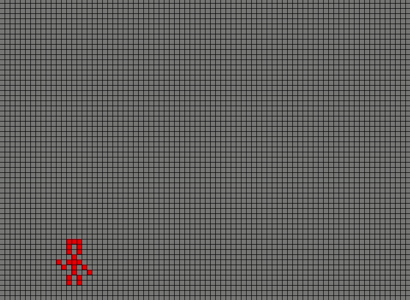

# GameOfLife
The Game of Life is a zero player game, which is to say that the entire evolution of the game is determined by the boards initial state. The rules for the development of each generation of the game state were developed by mathematician John Conway and are as follows:

    1. Any live cell with two or three live neighbors survives. 
    2. Any dead cell with three live neighbors becomes a live cell. 
    3. All other live cells die in the next generation. Similarly, all other dead cells stay dead.
This repo contains an OO implementation of the game of life, where each square on the grid is represented as a cell object. The program also makes use of SFML to display the game visualization in a graphical user interface.



## How to play
- draw game state with your mouse
- run an iteration of the Game of Life by pressing the spacebar
- pause an iteration of the Game of Life by pressing the spacebar again
- reset game state by pressing 'r'

## Build
The build requires 
- SFML
- gcc
- make

**Install SFML on linux**
```
sudo apt-get install libsfml-dev
```
## Run
Make the game with
```
make game
```

Run the game with 
```
./sfmal-app
```
